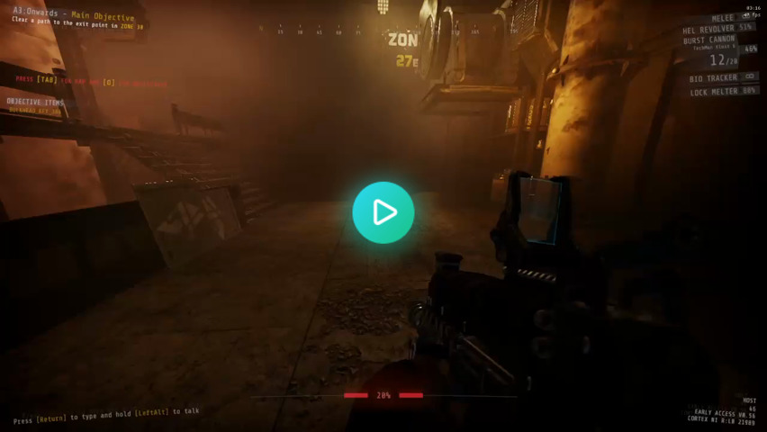
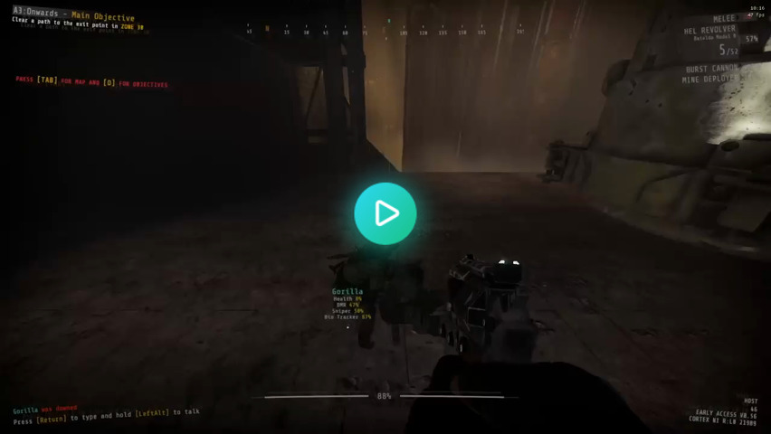
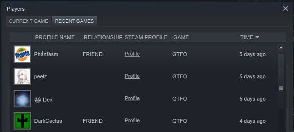

[//]: # (THIS FILE WAS AUTOMATICALLY GENERATED FROM scripts/readme/CHANGELOG.md)

## 0.3.2

### Bugfixes

- `FramerateLimiter`

    - Fixed a bug where the framerate would get uncapped if the target FPS was set to "infinite"

## 0.3.1

### Bugfixes

- `FixSoundMuffle`

    - Fixed active reset timer not working as client

- `BetterInteractions`

    - Temporarily disabled the patch that allowed interactions while reloading as it caused strikers to have no cooldown between tongue attacks

- `FramerateLimiter`

    - Now clamps the MaxFPS value using the value from your video settings

- `BetterWeaponSwap`

    - Fixed a bug where climbing a ladder would cause the patch to stop working

## 0.3.0

### Features and changes

- Added `RunReloadCancel`

    Lets you cancel your reload by sprinting rather than having to swap weapons.

    

- Added `BetterInteractions`

    Fixes several quirks of the interaction system, namely:

    - Hacking tool minigame would get cancelled if you swapped weapons or moved too early

    - The mine deployer would prioritize interacting with doors over placing mines

    - Mines placed high up would be hard to pick up while jumping

    - Placing sentries/mines would get cancelled while the player is walking/running

    - Overlapping items (e.g. cells) would cause the interaction to cancel because the game couldn't decide which one you were trying to interact with

    - Reloading would disable interactions

    - Reviving teammates would cancel for seemingly no reason; with this patch, you can **look around freely** while reviving.

    

- Added `BetterMovement`

    Lets you charge/reload your weapons mid-air. This also fixes the bug where your melee weapon would release prematurely when bunny-hopping.

    

- Added `FixWeaponAnimations`

    Animation sequences (e.g. reload) would carry over when switching weapons.

    

- Added `RecentlyPlayedWith`

    Updates the Steam recent players list.

    

- Added `FramerateLimiter`

    Lowers your FPS when alt-tabbing to preserve system resources.

- Added `ScreenLiquidRemoval`

    Prevents screen liquid effects from playing. This can be configured to remove blood, spitter or infection effects.

- Added `PlayerAmbientLight`

    This lets you alter the player ambient light range. The ambient light is often the only source of light in dark areas.

- `FixSoundMuffle`

    - Now also fixes the map muffle sound effect not going away under certain circumstances

    - Added an activer timer that forcefully stops the muffle sound effect ~10 seconds after a scout is done screaming

### Bugfixes

- `DropResources`

    - Fixed placeholders incorrectly syncing when hot-dropping, causing players to be able to interact with items/placeholders in closed lockers

    - Fixed player pings not working due to having the patch disabled

- `BetterWeaponSwap`

    - Fixed cells/turbines/spheres not being affected by the patch

- `FixFlashlightState`

    - Fixed deployables (e.g. sentries) not updating flashlight state

### Miscellaneous

- Added `UnityCursor` (for developers)

    Locks the cursor when Unity Explorer is open to prevent accidentally interacting with the game

- Added `DisableCrashReporter`

    Disables the Unity crash reporter to prevent spamming 10CC with tainted (modded) crash reports

## 0.2.1

- Fixed `FixSoundMuffle` not changing the correct sound effect

## 0.2.0

- Added `FixFlashlightState`

    Fixes the bug where your flashlight would turn off after dropping an item.

- Added `FixSoundMuffle`

    Fixes the bug where the scout muffle sound effect doesn't go away when exiting a game too early.

- Disabled `FixTerminalDisplayPing` due to world generation errors

## 0.1.0

Initial release
