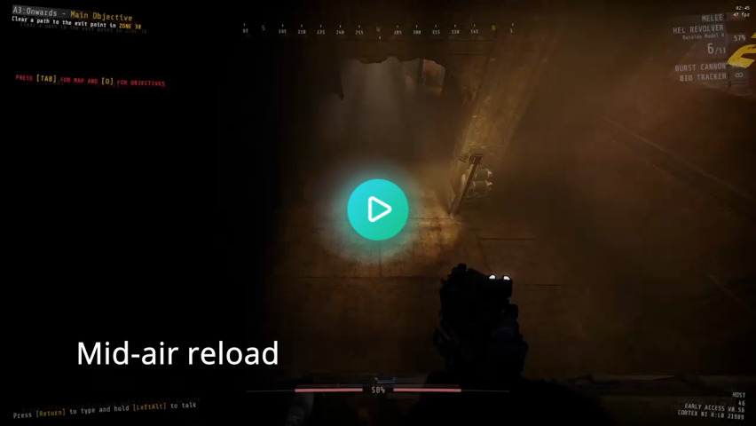

[//]: # (THIS FILE WAS GENERATED FROM QoL.BetterMovement/Templates/README.md)
[//]: # (release: standalone)

# QoL - Better Movement

Improves the GTFO movement system. Currently only lets you charge/reload your weapons mid-air.

## Changelog

## 0.1.0

Initial release

