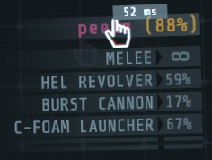
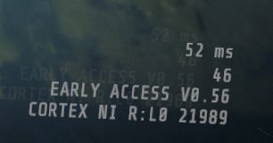

[//]: # (THIS FILE WAS GENERATED FROM QoL.LatencyInfo/Templates/README.md)
[//]: # (release: standalone)

# QoL - Latency Info

Displays network latency on your HUD.

 
Known bugs: due to a bug with the way GTFO estimates network latency, the ping is only updated once upon joining a game.

## Changelog

## 0.1.0

Initial release

