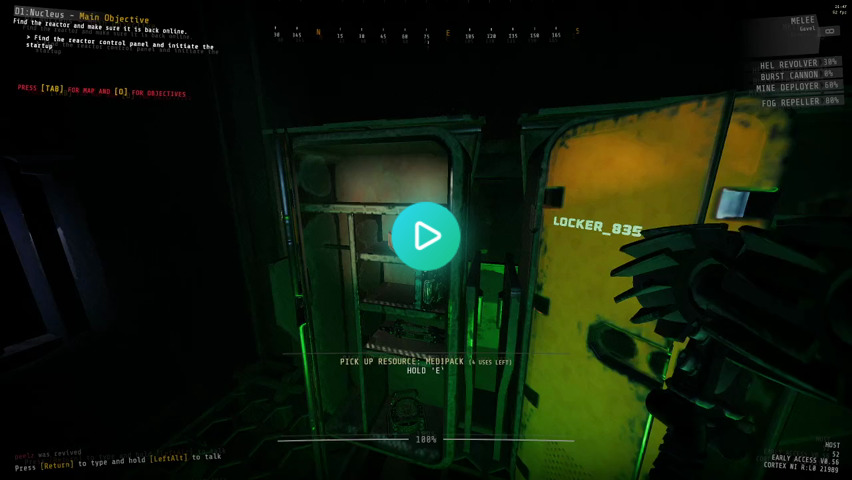
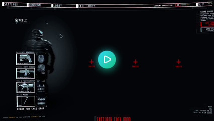
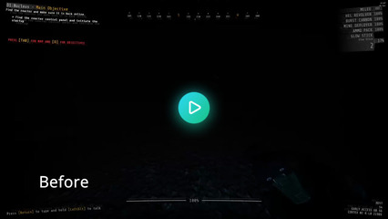
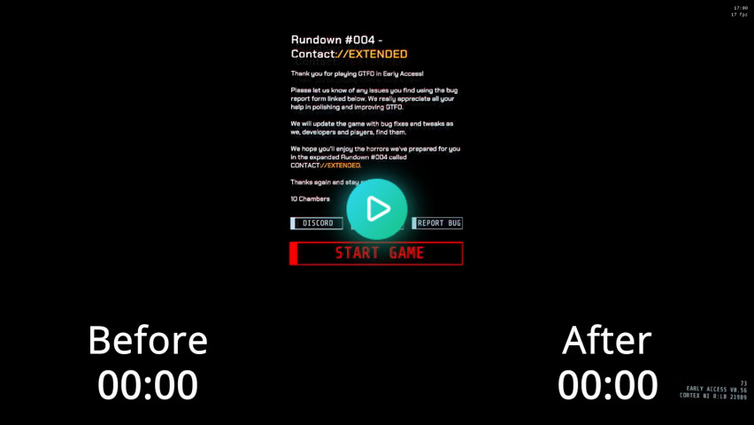
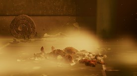
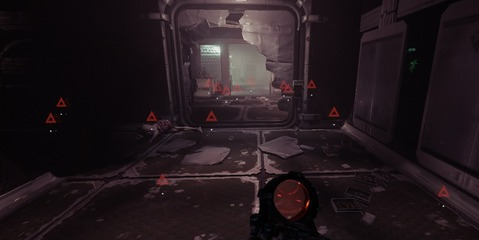
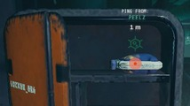

[//]: # (THIS FILE WAS AUTOMATICALLY GENERATED FROM scripts/readme/README.md)

# QoL Fix

A general [GTFO](https://store.steampowered.com/app/493520/GTFO) improvement mod that aims to fix quality of life issues, bugs and add various tweaks.

## How to install

1. Download the latest [IL2CPP x64 BepInEx build](https://builds.bepis.io/projects/bepinex_be)
2. Extract the archive to your game folder (`steamapps/common/GTFO`)
3. [Download the latest version of QoL Fix](https://github.com/notpeelz/GTFO-QoLFix/releases) and put the DLL file in `BepInEx/plugins`
4. Download the [Unity 2019.4.1 libraries archive](https://github.com/LavaGang/Unity-Runtime-Libraries/raw/master/2019.4.1.zip) and extract it in `BepInEx/unity-libs`. Create the folder if it doesn't exist.
5. Launch your game

## Features

### DropResources

Lets you put resources/consumables back in lockers/boxes.

### LatencyHUD

Displays network latency on your HUD.

 

Known bugs: due to a bug with the way GTFO estimates network latency, the ping is only updated once upon joining a game.

### SteamProfileLink

Lets you open the steam profile of your teammates by clicking on their name.

### BetterWeaponSwap

Changes the weapon swap order dynamically based on the drama state of the game (stealth, combat, etc.)

This prevents accidentally switching back to your primary weapon after, e.g., running out of glowsticks.

### IntroSkip

Skips the game intro on startup. Gets you on the rundown screen within seconds of launching the game!

### ElevatorVolume

Lowers the game volume during the elevator scene. No more alt-tabbing or screaming to your teammates during the elevator sequence!

### ElevatorIntroSkip

Skips the intro that plays when dropping into a level.

### BetterInteractions

Fixes several quirks of the interaction system, namely:

- Hacking tool minigame would get cancelled if you swapped weapons or moved too early
- The mine deployer would prioritize interacting with doors over placing mines
- Mines placed high up would be hard to pick up while jumping
- Placing sentries/mines would get cancelled while the player is walking/running
- Overlapping items (e.g. cells) would cause the interaction to cancel because the game couldn't decide which one you were trying to interact with
- Reloading would disable interactions
- Reviving teammates would cancel for seemingly no reason; with this patch, you can **look around freely** while reviving.

### RunReloadCancel

Lets you cancel your reload by sprinting rather than having to swap weapons.

### BetterMovement

Improves the GTFO movement system. Currently only lets you charge/reload your weapons mid-air.

### LobbyUnready

Lets you unready after readying up.

### ResourceAudioCue

Plays a sound when receiving ammo or health from a teammate.

### TerminalPingableSwaps

Relists swapped out items on terminals.

This lets you list/ping/query items after moving them.

Known bugs: when pinging a swapped item, the ping icon will not show up for swapped items unless you're the host. The ping audio will still play regardless of being host or client.

### RecentlyPlayedWidth

Updates the Steam recent players list.

### FramerateLimiter

Lowers your FPS when alt-tabbing to preserve system resources.

### ScreenLiquidRemoval

(default: disabled)

Prevents screen liquid effects from playing. This can be configured to remove blood, spitter or infection effects.

### NoiseRemoval

(default: disabled)

Disables the blue noise shader. This makes the game look clearer, although some areas might look a lot darker than normal.

| Before | After |
| ------ | ----- |
|  |  |

### PlayerAmbientLight

(default: disabled)

This lets you alter the player ambient light range. The ambient light is often the only source of light in dark areas. Careful not to set it too low!
NOTE: for balance reasons, you can't increase it past the default vanilla value (10)

### HideCrosshair

(default: disabled)

Hides the in-game crosshair when a weapon is out. Only useful if using [an external crosshair](https://github.com/notpeelz/reshade-xhair)... or if you fancy playing without a crosshair :)

### DisableSteamRichPresence

(default: disabled)

Disables Steam Rich Presence updates; also prevents Steam friends from seeing your lobby from the rundown screen.

## Bugfixes

Fixes these bugs:

- (**FixBioScannerNavMarker**) bio tracker tags would remain on screen after multiple scans; no more floating triangles everywhere!

  

- (**FixToolRefillBioScanner**) bio tracker could be given tool refills
- (**FixLockerPing**) resources inside of lockers/boxes weren't individually pingable

  

- (**FixDoorCollisionPatch**) c-foam globs could go through doors if aimed at the cracks

  Note: this bugfix also fixes the door double-hit exploit

- (**FixDoorFramePing**) the door frames on the tech tileset weren't pingable
- (**FixSoundMuffle**) the scout/map muffle sound effect wouldn't get reset under certain circumstances
- (**FixFlashlightState**) the flashlight would turn off when dropping/swapping items
- (**FixWeaponAnimations**) animation sequences (e.g. reload) would carry over when switching weapons

## Credits

Thanks a lot to:
- DarkCactus, fanta, Solakka, Gorilla, Phantasm, easternunit100, Dex and Project Zaero for helping me test during development
- knah, Spartan, js6pak, dak and ghorsington for answering my thousands of questions

## Licensing

This project uses code from:

- (GPL-3.0) [UnityExplorer](https://github.com/sinai-dev/UnityExplorer) - uses its UI code for update notifications
- (Apache-2.0) [Roslynator](https://github.com/JosefPihrt/Roslynator) - uses its C# analyzer extension methods
